# 高性能计算（HPC）影响因素与优化方案

> 基于 `matrix_acc` 矩阵加速库的实践经验总结

---

## 目录

1. [概述](#1-概述)
2. [核心影响因素](#2-核心影响因素)
3. [存储层次与缓存优化](#3-存储层次与缓存优化)
4. [SIMD 向量化](#4-simd-向量化)
5. [GPU 异构加速](#5-gpu-异构加速)
6. [多线程并行](#6-多线程并行)
7. [内存管理与对齐](#7-内存管理与对齐)
8. [数值精度与量化](#8-数值精度与量化)
9. [总结与最佳实践](#9-总结与最佳实践)

---

## 1. 概述

高性能计算（HPC）的核心目标是**在有限硬件资源下最大化计算吞吐量**。在矩阵运算（如 GEMM）等密集计算场景中，性能瓶颈通常不在 CPU/GPU 的峰值算力本身，而在于数据供给速度、并行效率以及算法与硬件的匹配程度。

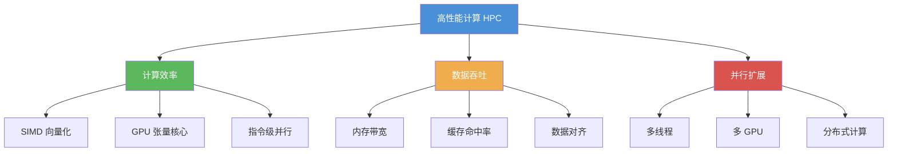

---

## 2. 核心影响因素

### 2.1 影响性能的五大维度

| 维度 | 影响因素 | 典型瓶颈 |
|------|---------|---------|
| **计算密度** | 算法复杂度、指令效率 | 低效算法、分支预测失败 |
| **内存带宽** | DRAM 速度、总线宽度 | 数据搬运时间超过计算时间 |
| **缓存效率** | 数据局部性、访问模式 | Cache Miss、TLB 抖动 |
| **并行度** | 线程数、任务粒度 | 同步开销、负载不均衡 |
| **I/O 延迟** | PCIe 带宽、网络延迟 | H2D/D2H 传输成为短板 |

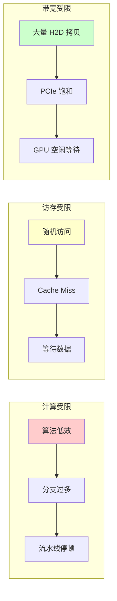

### 2.2 罗of线（Roofline）模型

罗of线模型是分析性能瓶颈的经典工具，它将算力峰值与内存带宽峰值绘制在同一图中：

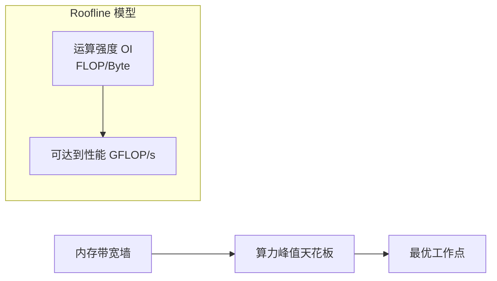

- **运算强度 OI** = 总浮点运算量 / 总数据搬运量
- **OI 低** → 带宽受限（Memory-Bound）
- **OI 高** → 计算受限（Compute-Bound）

例如：1024×1024 的矩阵乘法 OI ≈ N/4 = 256 FLOPS/Byte（较高，偏向计算受限），但实际中仍受缓存效率制约。

---

## 3. 存储层次与缓存优化

### 3.1 存储金字塔

现代计算系统的存储层次呈金字塔结构，越靠近计算单元速度越快、容量越小：

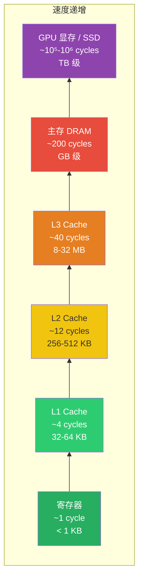

### 3.2 缓存优化策略

#### (1) 时间局部性（Temporal Locality）
重复使用同一数据，尽量保持在寄存器或 L1 中。

```cpp
// 好：累加器保持在寄存器中
float s = 0.f;
for (int k = 0; k < N; ++k)
    s += arow[k] * B.row(k)[j];   // s 被重复使用 N 次
crow[j] = s;
```

#### (2) 空间局部性（Spatial Locality）
访问连续内存地址，充分利用 Cache Line（通常 64 字节）。

```cpp
// 好：行优先遍历，连续访问
for (int i = 0; i < N; ++i)
    for (int j = 0; j < N; ++j)
        C[i][j] = A[i][k] * B[k][j];  // C[i][j] 连续

// 差：列优先遍历，跨步访问
for (int j = 0; j < N; ++j)
    for (int i = 0; i < N; ++i)
        C[i][j] = A[i][k] * B[k][j];  // C[i][j] 跨 N 个元素
```

#### (3) 分块（Tiling / Blocking）
将大矩阵切分为能放入缓存的小块进行计算。

```mermaid
graph TD
    subgraph 大矩阵 N×N
        subgraph Block1["Block 0,0"]
            B1[...]
        end
        subgraph Block2["Block 0,1"]
            B2[...]
        end
        subgraph Block3["Block 1,0"]
            B3[...]
        end
        subgraph Block4["Block 1,1"]
            B4[...]
        end
    end

    Block1 --> T1["放入 L2 Cache<br/>块内计算"]
    Block2 --> T2["下一块"]
```

```cpp
// 分块矩阵乘法伪代码
const int BLOCK = 64;  // 适合 L1/L2 缓存的块大小
for (int ii = 0; ii < N; ii += BLOCK)
    for (int jj = 0; jj < N; jj += BLOCK)
        for (int kk = 0; kk < N; kk += BLOCK)
            // 块内计算：所有数据在缓存中
            for (int i = ii; i < min(ii+BLOCK, N); ++i)
                for (int j = jj; j < min(jj+BLOCK, N); ++j)
                    for (int k = kk; k < min(kk+BLOCK, N); ++k)
                        C[i][j] += A[i][k] * B[k][j];
```

---

## 4. SIMD 向量化

### 4.1 什么是 SIMD

**SIMD（Single Instruction, Multiple Data）**：一条指令同时处理多个数据。现代 CPU 提供不同宽度的向量寄存器：

| 指令集 | 寄存器宽度 | 单精度浮点并行度 |
|--------|-----------|-----------------|
| SSE | 128 bit | 4 个 float |
| AVX | 256 bit | 8 个 float |
| AVX-512 | 512 bit | 16 个 float |

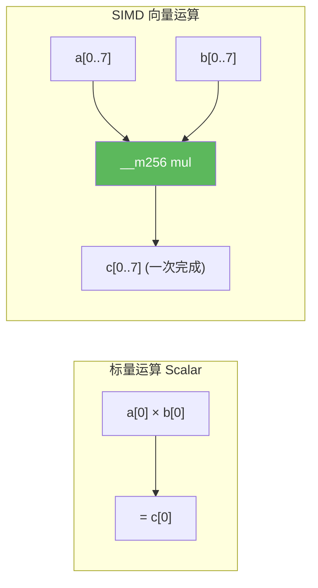

### 4.2 内存对齐要求

SIMD 指令要求数据在内存中**对齐**，否则会触发异常或性能下降：

```cpp
// matrix_acc 中的对齐策略
#if __AVX__
    #define MALLOC_ALIGN 256   // AVX 需要 32 字节对齐，256 为安全余量
#else
    #define MALLOC_ALIGN 64    // SSE 需要 16 字节对齐
#endif

// 指针对齐
template<typename _Tp>
static inline _Tp* alignPtr(_Tp* ptr, int n = (int)sizeof(_Tp))
{
    return (_Tp*)(((size_t)ptr + n - 1) & -n);
}

// 使用示例
float* A = (float*)fastMalloc(bytes + 64);
A = alignPtr(A, 16);   // 16 字节对齐，适合 SSE/AVX 加载
```

### 4.3 SIMD 优化要点

1. **数据对齐**：使用 `_mm256_load_ps`（对齐加载）而非 `_mm256_loadu_ps`（非对齐加载）
2. **循环展开**：减少循环开销，增加指令级并行
3. **避免 Gather/Scatter**：尽量使用连续访问模式
4. **寄存器分配**：合理使用寄存器，减少溢出（spill）

---

## 5. GPU 异构加速

### 5.1 CPU vs GPU 架构差异

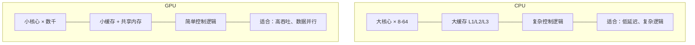

### 5.2 GPU 编程关键因素

#### (1) 数据传输开销

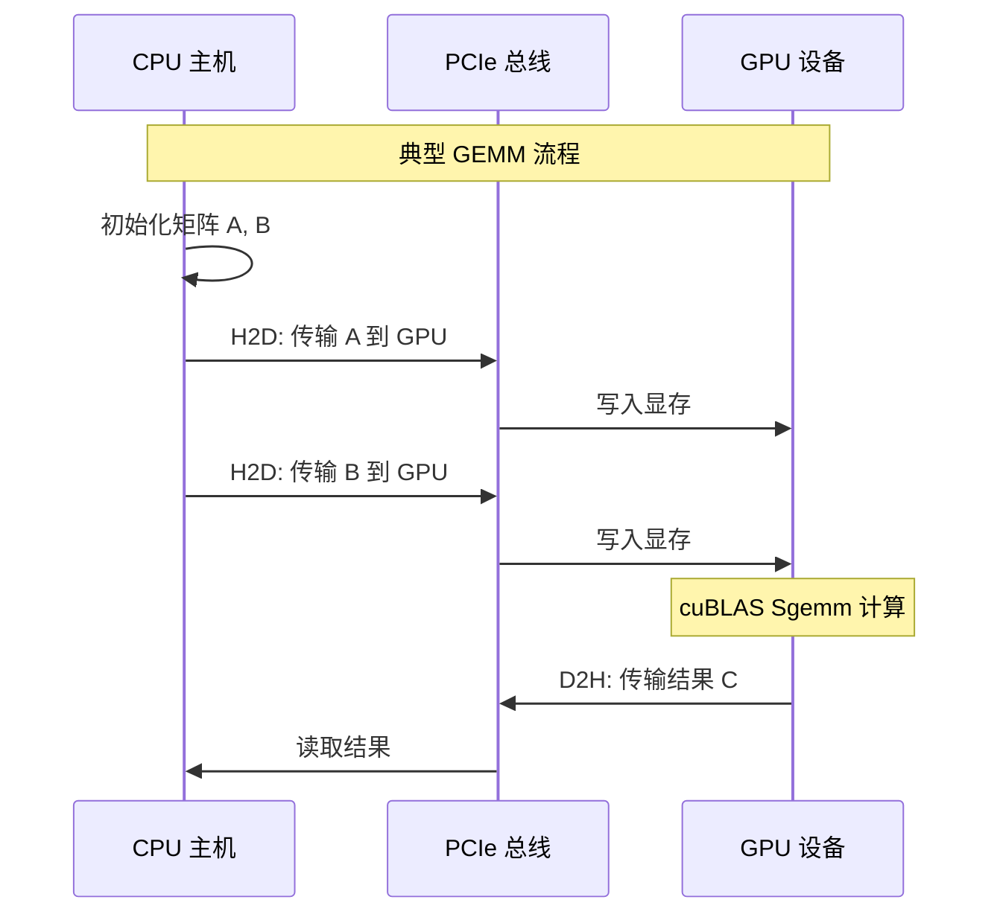

**关键指标**：
- PCIe 3.0 ×16 带宽：~16 GB/s
- GPU 显存带宽（如 A100）：~2000 GB/s
- **尽量减少 H2D/D2H 传输次数**，尽量在 GPU 端完成所有计算

#### (2) 使用高效库

```cpp
// 使用 cuBLAS 而非手写 CUDA kernel
cublasHandle_t handle;
cublasCreate(&handle);

const float alpha = 1.0f, beta = 0.0f;
cublasSgemm(handle,
    CUBLAS_OP_N, CUBLAS_OP_N,  // 不转置
    N, N, N,                    // M, N, K
    &alpha,
    d_B, N,                     // B 矩阵 (列优先)
    d_A, N,                     // A 矩阵
    &beta,
    d_C, N);                    // 结果矩阵
```

cuBLAS 内部已高度优化：分块、共享内存、Warp 级优化、Tensor Core 利用。

#### (3) 异步流水线

使用 CUDA Stream 实现数据传输与计算重叠：

```mermaid
gantt
    title CUDA Stream 流水线
    dateFormat  X
    axisFormat %s

    section Stream 1
    H2D Block 1 :a1, 0, 2
    Compute Block 1 :a2, after a1, 4
    D2H Block 1 :a3, after a2, 2

    section Stream 2
    H2D Block 2 :b1, 0, 2
    Compute Block 2 :b2, after b1, 4
    D2H Block 2 :b3, after b2, 2
```

---

## 6. 多线程并行

### 6.1 并行模式

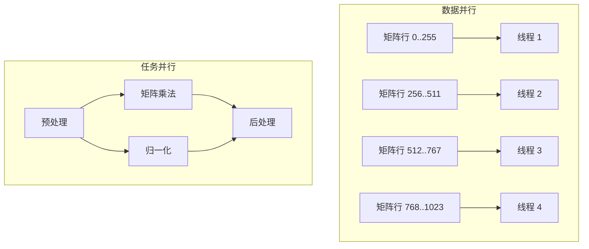

### 6.2 线程同步原语

`matrix_acc` 项目实现了跨平台的线程同步工具：

| 原语 | 用途 |
|------|------|
| `Mutex` | 互斥锁，保护共享资源 |
| `ConditionVariable` | 条件变量，线程等待/通知 |
| `Thread` | 线程封装 |
| `ThreadLocalStorage` | 线程局部存储，避免锁竞争 |
| `MutexLockGuard` | RAII 锁守卫，自动释放 |

### 6.3 常见并行陷阱

1. **伪共享（False Sharing）**：多个线程修改同一 Cache Line 的不同变量
   - 解决：填充对齐（Padding），确保每个线程的数据独占 Cache Line
2. **锁竞争**：过多线程争抢同一锁
   - 解决：细粒度锁、无锁数据结构、线程局部缓冲区
3. **负载不均衡**：部分线程任务重，部分空闲
   - 解决：动态任务调度（Work Stealing）

```cpp
// 避免伪共享：填充到 Cache Line 大小
struct alignas(64) PaddedCounter {
    int count;
    char padding[60];  // 确保独占一个 Cache Line
};
```

---

## 7. 内存管理与对齐

### 7.1 自定义分配器

`matrix_acc` 实现了对齐内存分配器 `fastMalloc`：

```cpp
static inline void* fastMalloc(size_t size, size_t align = MALLOC_ALIGN)
{
    // 分配额外空间以存储原始指针和对齐偏移
    // 返回对齐后的地址
}
```

**设计要点**：
- 预分配 + 对齐：避免每次 `cudaMalloc` 的开销
- 内存池复用：减少碎片和分配/释放开销
- 对齐到 Cache Line 边界：提高 SIMD 和缓存效率

### 7.2 对齐对性能的影响

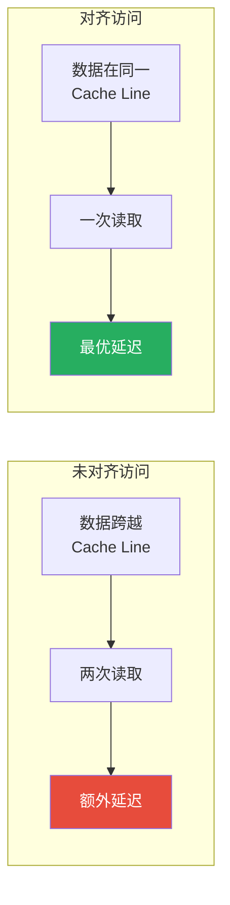

---

## 8. 数值精度与量化

### 8.1 精度-性能权衡

| 精度 | 位宽 | 带宽节省 | 适用场景 |
|------|------|---------|---------|
| FP32 | 32 bit | 1× (基准) | 训练、高精度推理 |
| FP16 | 16 bit | 2× | 推理加速、混合精度训练 |
| INT8 | 8 bit | 4× | 边缘推理 |
| INT4 | 4 bit | 8× | 极致压缩 |

### 8.2 FP16 转换

`matrix_acc` 实现了 `float32_to_float16` / `float16_to_float32` 转换：

```cpp
// FP32 -> FP16（半精度浮点）
unsigned short float32_to_float16(float value)
{
    // 1-bit sign | 8-bit exponent | 23-bit significand
    //        ↓ 压缩为
    // 1-bit sign | 5-bit exponent | 10-bit significand
}

// FP16 -> FP32（恢复）
float float16_to_float32(unsigned short value)
{
    // 反向扩展
}
```

### 8.3 混合精度训练

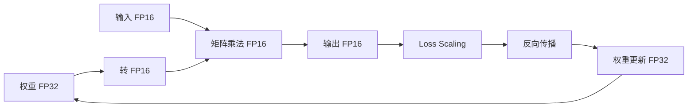

---

## 9. 总结与最佳实践

### 9.1 优化决策树

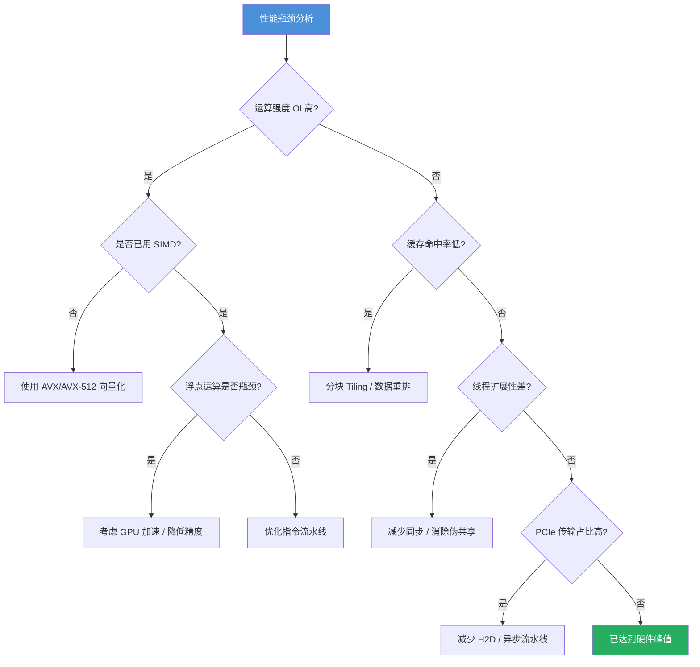

### 9.2 核心优化清单

| # | 优化项 | 方法 | 预期收益 |
|---|--------|------|---------|
| 1 | **SIMD 向量化** | 使用 AVX/AVX-512 指令，对齐数据 | 2×-8× |
| 2 | **缓存分块** | 矩阵分块计算，提高缓存命中率 | 2×-5× |
| 3 | **GPU 加速** | 使用 cuBLAS，减少 H2D 传输 | 10×-100× |
| 4 | **内存对齐** | 对齐到 Cache Line / SIMD 宽度 | 10%-30% |
| 5 | **多线程** | 数据并行 + 避免伪共享 | 接近线性扩展 |
| 6 | **精度降低** | FP16/INT8 量化推理 | 2×-4× 吞吐 |
| 7 | **异步流水** | CUDA Stream 重叠传输与计算 | 隐藏延迟 |
| 8 | **内存池** | 预分配复用，减少碎片 | 稳定延迟 |

### 9.3 性能分析工具

- **CPU**：`perf`、`VTune`、`valgrind --tool=cachegrind`
- **GPU**：`nvprof`、`Nsight Systems`、`Nsight Compute`
- **通用**：Roofline Model 分析

---

> 📝 **文档说明**：本文基于 `matrix_acc` 矩阵加速库（ncnn 风格）的开发实践，覆盖了从 CPU SIMD 到 GPU CUDA 的完整优化链路。具体代码实现请参考项目源码。
